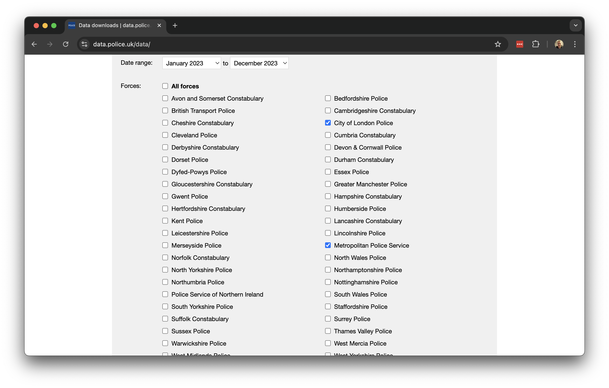

# Spatial Queries and Geometric Operations
This week, we look at geometric operations and spatial queries: the fundamental building blocks when it comes to spatial data processing and analysis. This includes operations such as calculating the distances separating one or more spatial objects, running a *buffer* analysis, and *intersecting* different spatial layers.

## Lecture slides
You can download the slides of this week's lecture here: [[Link]]().

## Reading list 
#### Essential readings {.unnumbered}
- Longley, P. *et al.* 2015. Geographic Information Science & Systems, **Chapter 2**: *The Nature of Geographic Data*, pp. 33-54. [[Link]](https://ucl.rl.talis.com/link?url=https%3A%2F%2Fapp.knovel.com%2Fhotlink%2Ftoc%2Fid%3AkpGISSE001%2Fgeographic-information-science%3Fkpromoter%3Dmarc&sig=e437927b963cc591dcb65491eccdd3869cc31aef80e1443cb2ba12d8f3bb031a)
- Longley, P. *et al.* 2015. Geographic Information Science & Systems, **Chapter 3**: *Representing Geography*, pp. 55-76. [[Link]](https://ucl.rl.talis.com/link?url=https%3A%2F%2Fapp.knovel.com%2Fhotlink%2Ftoc%2Fid%3AkpGISSE001%2Fgeographic-information-science%3Fkpromoter%3Dmarc&sig=e437927b963cc591dcb65491eccdd3869cc31aef80e1443cb2ba12d8f3bb031a)
- Longley, P. *et al.* 2015. Geographic Information Science & Systems, **Chapter 7**: *Geographic Data Modeling*, pp. 152-172.  [[Link]](https://ucl.rl.talis.com/link?url=https%3A%2F%2Fapp.knovel.com%2Fhotlink%2Ftoc%2Fid%3AkpGISSE001%2Fgeographic-information-science%3Fkpromoter%3Dmarc&sig=e437927b963cc591dcb65491eccdd3869cc31aef80e1443cb2ba12d8f3bb031a)

#### Suggested readings {.unnumbered}
- Lovelace, R., Nowosad, J. and Muenchow, J. 2021. Geocomputation with R, **Chapter 4**: *Spatial data operations*. [[Link]](https://geocompr.robinlovelace.net/spatial-operations.html)
- Lovelace, R., Nowosad, J. and Muenchow, J. 2021. Geocomputation with R, **Chapter 5**: *Geometry operations*. [[Link]](https://geocompr.robinlovelace.net/geometry-operations.html)
- Lovelace, R., Nowosad, J. and Muenchow, J. 2021. Geocomputation with R, **Chapter 6**: *Reprojecting geographic data*. [[Link]](https://geocompr.robinlovelace.net/reproj-geo-data.html)

## Bike theft in London I
This week, we will examine patterns of bicycle theft in London and the extent to which these cluster around stations. We will be using open data from [data.police.uk](https://data.police.uk/) on reported crimes alongside [OpenStreetMap](https://www.openstreetmap.org/#map=6/54.91/-3.43) data for this analysis. We will use R to directly download the necessary data from OpenStreetMap, but the crime data will need to be manually downloaded from the data portal. We further have access to a `GeoPackage` that contains the London 2021 MSOA boundaries that we can use as reference layer. If you do not already have it on your computer, save this file under `data/spatial`.

| File                                        | Type   | Link |
| :------                                     | :------| :------ |
| London MSOA 2021 Spatial Boundaries         | `GeoPackage` | [Download](https://github.com/jtvandijk/GEOG0030/raw/refs/heads/main/data/spatial/London-MSOA-2021.gpkg) |

### Crime data
To download the crime data:

1. Start by navigating to [data.police.uk](https://data.police.uk/). And click on **Downloads**.
2. Under the data range select `January 2023` to `December 2023`.
3. Under the **Custom download** tab select `Metropolitan Police Service` and `City of London Police`. Leave the other settings unchanged and click on **Generate file**.

```{r}
#| label: fig-police-data
#| echo: False 
#| fig-cap: 'Downloading data on reported crimes through [data.police.uk](https://data.police.uk/)'

```

4. It may take a few minutes for the download to be generated, so be patient. Once the **Download now** button appears, you can download the dataset.
5. After downloading, unzip the file. You will find that the zip file contains 12 folders, one for each month of 2023. Each folder includes two files: one for the `Metropolitan Police Service` and one for the `City of London Police`.
6. Create a new folder named `London-Crime` within your `data/attributes` directory, and copy all 12 folders with the data into this new folder.

To get started, let us create our first script. **File** -> **New File** -> **R Script**. Save your script as `w02-bike-theft.r`. 

We will start by loading the libraries that we will need:

```{r}
#| label: 02-load-libraries
#| classes: styled-output
#| echo: True
#| eval: True
#| output: False
#| tidy: True
#| filename: 'R code'
# load libraries
library(tidyverse)
library(janitor)
library(sf)
library(tmap)
library(osmdata)
```

::: {.callout-warning}
You may have to install some of these libraries if you have not used these before.
:::

Although we could read each individual crime file into R one by one and then combine them, we can actually accomplish this in a single step:

```{r tidy='styler'}
#| label: 02-combine-csv
#| echo: True
#| eval: True
#| message: False
#| filename: 'R code'
# list all csv files
crime_df <- list.files(path='data/attributes/London-Crime/', full.names=TRUE, recursive=TRUE) |>
  # read individual csv files
  lapply(read_csv) |>
  # bind together into one
  bind_rows()

# inspect
head(crime_df)
```

::: {.callout-note}
Depending on your computer, processing this data may take some time due to the large volume involved. Once completed, you should have a dataframe containing **1,144,329** observations.
:::

::: {.callout-note}
You can further inspect both objects using the `View()` function. 
:::

The column names contain spaces and are therefore not easily referenced. We can easily clean this up using the `janitor` package:

```{r}
#| label: 02-rename-fields
#| classes: styled-output
#| echo: True
#| eval: True
#| tidy: True
#| filename: 'R code'
# clean names
crime_df <- crime_df |>
  clean_names()
```

For our analysis, we are currently only interested in reported bicycle thefts, so we need to filter our data based on the `crime_type` column. We can start by examining the unique values in this column and then subset the data accordingly:

```{r}
#| label: 02-filter-crime
#| classes: styled-output
#| echo: True
#| eval: True
#| tidy: True
#| filename: 'R code'
# unique types
unique(crime_df$crime_type)

# filter
theft_bike <- crime_df |>
  filter(crime_type == 'Bicycle theft')

# inspect
head(theft_bike)
```

Now that we have filtered the data to only include reported bicycle thefts, we need to convert our dataframe into a spatial dataframe that maps the locations of the crimes using the recorded latitude and longitude coordinates. We can then project this spatial dataframe into the British National Grid (`EPSG:27700`).

```{r}
#| label: 02-locate-crime
#| classes: styled-output
#| echo: True
#| eval: True
#| tidy: True
#| filename: 'R code'
# to spatial data
theft_bike <- theft_bike |>
  filter(!is.na(longitude) & !is.na(latitude)) |>
  st_as_sf(coords = c('longitude', 'latitude'), crs = 4236) |>
  st_transform(27700)

# inspect
head(theft_bike)
```

Let's map the dataset to get an idea of how the data looks like, using the outline of London as background:

```{r tidy='styler'} 
#| label: fig-02-theft-map
#| fig-cap: Reported bicycle thefts in London.
#| classes: styled-output
#| echo: True
#| eval: True
#| filename: 'R code'
# read spatial dataset
msoa21 <- st_read('data/spatial/London-MSOA-2021.gpkg')

# london outline
outline <- msoa21 |>
  st_union()

# shape, polygon
tm_shape(outline) +
  
  # specify colours
  tm_polygons(
    col = '#f0f0f0', 
  ) +
  
# shape, points
tm_shape(theft_bike) + 
  
  # specify colours
  tm_dots(
    col = '#fdc086',
    size = 0.05,
    title = ''
  ) 
```

### Station data
OpenStreetMap (OSM) is a free, editable map of the world. Each map element (whether a point, line, or polygon) in OSM is tagged with various attribute data. To download the station data we need, we must use the appropriate tags, represented as `key` and `value` pairs, to query the OSM database. In our case, we are looking for train stations, which fall under the *Public Transport* `key`, with a `value` of *station*. Additionally, to limit our search to a specific area of interest, we can use the spatial extent of the 2021 MSOA boundaries as the bounding box for data extraction.

```{r tidy='styler'} 
#| label: 02-station-data
#| classes: styled-output
#| echo: True
#| eval: True
#| warning: False
#| cache: True
#| filename: 'R code'
# define our bbox coordinates, use WGS84
bbox_london <- msoa21 |>
  st_transform(4326) |>
  st_bbox()
  
# osm query
osm_stations <- opq(bbox = bbox_london) |>
  add_osm_feature(key = 'public_transport', value = 'station') |>
  osmdata_sf()
```

::: {.callout-warning}
In some cases, the OSM query may return an error, particularly when multiple users from the same location are executing the exact same query. If so, you can download a prepared copy of the data here: [[Download]](https://github.com/jtvandijk/GEOG0030/raw/master/data/spatial/London-OSM-Stations.RData). You can load this copy into R through `load('data/London-OSM-Stations.RData')`
:::

The OSM query returns all data types, including lines and polygons tagged as stations. For our analysis, we only want to retain the point locations. Additionally, we need to clip the results to the outline of London to exclude points that fall within the bounding box but outside the boundaries of Greater London.


```{r}
#| label: 02-station-point-data
#| classes: styled-output
#| echo: True
#| eval: True
#| tidy: True
#| filename: 'R code'
# extract points
osm_stations <- osm_stations$osm_points |>
  st_set_crs(4326) |>
  st_transform(27700) |>
  st_intersection(outline) |>
  select(c('osm_id', 'name', 'network', 'operator', 'public_transport', 'railway'))

# inspect
head(osm_stations)

# inspect
nrow(osm_stations)
```

The total number of data points seems rather high. In fact, looking at the `railway` variable, several points are not tagged as station or do not have a value at all:

```{r}
#| label: 02-station-point-count
#| classes: styled-output
#| echo: True
#| eval: True
#| tidy: True
#| filename: 'R code'
# inspect values
count(osm_stations, railway)
```

The number of points tagged as station in the railway field are most likely the only points in our dataset that represent actual stations, so we will only retain those points.

```{r}
#| label: 02-station-point-extract
#| classes: styled-output
#| echo: True
#| eval: True
#| tidy: True
#| filename: 'R code'
# extract train and underground stations
osm_stations <- osm_stations |>
  filter(railway == 'station')
```

Let's map the dataset to get an idea of how the data looks like, using the outline of London as background:

```{r tidy='styler'} 
#| label: fig-02-statiot-map
#| fig-cap: Train and underground stations in London.
#| classes: styled-output
#| echo: True
#| eval: True
#| filename: 'R code'
# shape, polygon
tm_shape(outline) +
  
  # specify colours
  tm_polygons(
    col = '#f0f0f0', 
  ) +
  
# shape, points
tm_shape(osm_stations) + 
  
  # specify colours
  tm_dots(
    col = '#beaed4',
    size = 0.05,
    title = ''
  ) 
```


## Before you leave
And that is how you can conduct basic geometric operations and spatial queries using R and `sf`. Yet more RGIS coming over the next couple of weeks, but [this concludes the tutorial for this week](https://www.youtube.com/watch?v=Ydg4T2MP7Z8). Time to check out that reading list?